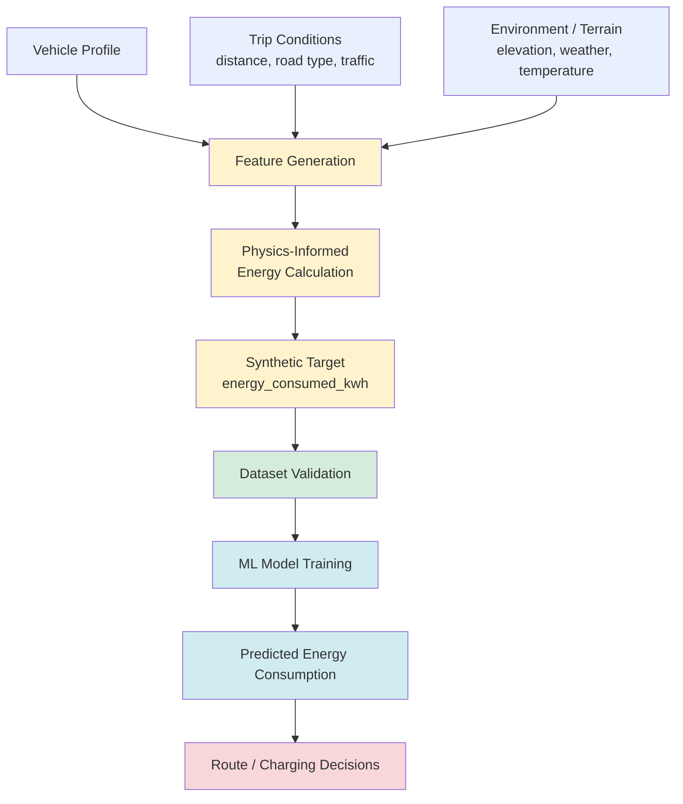

#RouteVolt #master-map

> [!warning] Status check (read this first)
> As of this note, RouteVolt's actual codebase is **skeleton only**: FastAPI routes (`routes.py`, `stations.py`) return hardcoded placeholders, `route_optimizer.py` returns a fixed dict, and `charger_service.py` is empty. There is **no trip-generator script, no physics formula code, and no trained ML model yet**.
>
> What *does* exist and is "approved":
> - `dataset_schema.md` — the approved design for a trip-level energy dataset (not yet generated)
> - `ev_station_dataset.csv` / `charging_stations.csv` — real station-snapshot data (ports, queue time, cost, traffic index) — a **separate** subsystem from the trip/energy model
>
> Every note in this vault will explicitly tag each idea as one of:
> **[DESIGN]** — approved schema/plan, not yet code · **[REAL DATA]** — actually in your CSVs · **[PHYSICS]** — general EV physics knowledge · **[TO BE BUILT]** — code that doesn't exist yet.

## The big picture

**Everything in this diagram except the CSV-based station data is currently [DESIGN], not running code.**

## What each block means

| Block | Meaning | Status |
|---|---|---|
| **Vehicle Profile** | Fixed set of 3 EV archetypes (`small_ev`, `mid_ev`, `large_ev`) with battery capacity + baseline Wh/km, per `dataset_schema.md` | [DESIGN] |
| **Trip Conditions** | Per-trip sampled values: distance, road type, traffic congestion level | [DESIGN] |
| **Environment/Terrain** | Elevation gain/loss, ambient temperature, weather condition | [DESIGN] |
| **Feature Generation** | The (not-yet-written) script that samples/derives all input features (X) for one trip row | [TO BE BUILT] |
| **Physics-Informed Energy Calculation** | The formula converting features → energy use, combining multiplicative efficiency adjustments and additive elevation terms — see [[03 - EV Physics]] | [TO BE BUILT], design reasoning in this vault |
| **Synthetic Target** | `energy_consumed_kwh` and `wh_per_km`, the two target columns from `dataset_schema.md` | [DESIGN] |
| **Dataset Validation** | Sanity checks you should run before trusting the generated data — see [[06 - Data Validation]] | [DESIGN / process, not code] |
| **ML Model** | Not yet trained — no training script exists | [TO BE BUILT] |
| **Predicted Energy Consumption** | Model output, feeding `route_optimizer.py`'s currently-hardcoded `charge_to` logic | [TO BE BUILT] |
| **Route/Charging Decisions** | `optimize_route()` in `routes.py`, currently returns a fixed placeholder response | Stub exists, logic [TO BE BUILT] |

## Two separate subsystems — don't conflate them

RouteVolt actually has **two independent data concerns**, and the schema doc is explicit about this:

1. **Trip/Energy model** (this vault's main focus) — `dataset_schema.md`, not yet generated. Predicts energy consumption for a *drive*.
2. **Station recommendation data** (already real, in `ev_station_dataset.csv` / `charging_stations.csv`) — ports, queue time, cost per kWh, traffic index *at a station*, used for picking *where to charge*, not for predicting drive energy use.

`dataset_schema.md` explicitly excludes `available_ports`, `occupied_ports`, `queue_time_minutes`, `cost_per_kwh` from the trip table because they have no causal relationship to energy consumption during a drive.

## Notes in this vault

- [[01 - Feature Map]] — every feature in the approved schema, explained
- [[02 - Feature Relationships]] — how features relate to each other, causally vs statistically
- [[03 - EV Physics]] — the physics behind energy consumption, taught from first principles
- [[04 - Target Generation]] — how the target variable would be built, stage by stage
- [[05 - Synthetic Dataset]] — dependency order for generating a believable trip
- [[06 - Data Validation]] — how to sanity-check the dataset once generated
- [[07 - ML Pipeline]] — what training on this data should look like
- [[08 - Leakage]] — the risks specific to a *formula-generated* target
- [[09 - Physics to Energy Flow]] — the physics pipeline as its own diagram
- [[10 - Correlation vs Causation]] — reasoning discipline for every relationship in this project
- [[11 - RouteVolt Learning Checklist]] — questions you should be able to answer unaided
