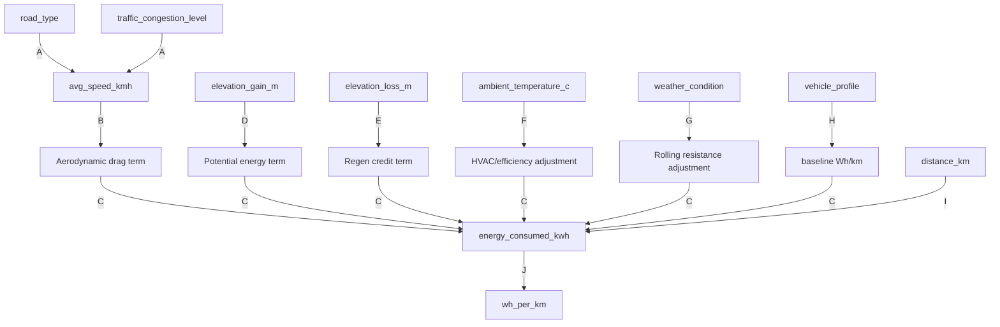
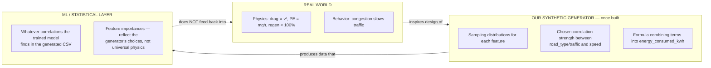

#RouteVolt #feature-relationships

Back to [[00 - RouteVolt Master Map]] · Previous: [[01 - Feature Map]]

> [!warning] These relationships are [DESIGN], not measured
> Because no generator script exists yet, these arrows describe the **intended** dependency structure implied by `dataset_schema.md`'s own notes (e.g., "traffic_congestion_level ... distinguishes slow-from-traffic vs slow-from-eco-driving" implies traffic → speed). Once the generator is written, re-derive this diagram from the actual sampling code, because the real correlations will only exist if someone codes them in.

## Relationship diagram

## Relationship classification

| Arrow | Relationship | Classification | Explanation |
|---|---|---|---|
| A: `road_type` → `avg_speed_kmh` | Real world: real (city driving is genuinely slower). Our data: **only if the generator codes it** | **Synthetic-data correlation** (once coded) / **Real-world statistical relationship** (in reality) | The schema *implies* this link but no sampler exists yet. Don't assume it's in the data until you check the actual sampling code. |
| A: `traffic_congestion_level` → `avg_speed_kmh` | Real-world causal (more congestion, genuinely lower average speed) | **Indirect causal relationship**, becomes **synthetic-data correlation** once implemented | This is closer to a real physical/behavioral mechanism than road_type alone. |
| B: `avg_speed_kmh` → drag term | Real world: physical (drag force ∝ v²) | **Physical causal relationship** | This is real physics, not a design choice — see [[03 - EV Physics]]. |
| C: [all terms] → `energy_consumed_kwh` | The generator formula literally sums/multiplies these | **Implementation dependency** | This is "true by construction" once the formula is coded — it's not something a correlation study would need to "discover," it's definitional. |
| D: `elevation_gain_m` → potential energy term | Real world: physical (mgh) | **Physical causal relationship** | See [[03 - EV Physics]] for the equation. |
| E: `elevation_loss_m` → regen credit | Real world: physical, but regen is *not* 100% efficient (schema explicitly says "not 1:1 with gain") | **Physical causal relationship, simplified** | The simplification (a fixed regen-efficiency factor) is a **simplified modelling assumption**, not raw physics. |
| F: `ambient_temperature_c` → HVAC/efficiency | Real world: physical + behavioral (heating/cooling load, battery chemistry) | **Physical causal relationship** (U-shaped, per schema) | Real EVs do show a U-shaped efficiency-vs-temperature curve; this is grounded, not arbitrary. |
| G: `weather_condition` → rolling resistance | Real world: physical (wet roads, minor drag change) but schema calls it "minor" | **Physical causal relationship (small magnitude)** | Legitimate but low-impact; don't let it dominate the model. |
| H: `vehicle_profile` → baseline Wh/km | By definition/lookup table | **Implementation dependency** | Not a statistical finding — it's a hardcoded table. |
| I: `distance_km` → `energy_consumed_kwh` | Real world: physical (more distance, more energy, roughly linear at fixed efficiency) | **Physical causal relationship** | The dominant driver — see [[08 - Leakage]] for why this is a double-edged sword for model evaluation. |
| J: `energy_consumed_kwh` → `wh_per_km` | Definitional division | **Implementation dependency** | Not a "relationship" to be learned; it's algebra. |

## Real world vs our synthetic generator vs ML/statistics — keep these separate

**The key discipline:** if you (or the model) later observe "in our data, higher traffic correlates with higher energy use," that is a fact about **SYN** (what the generator encodes), not automatically a fact about **RW** (real EVs) — even though in this case it's plausible both are true. Never skip the middle box. See [[10 - Correlation vs Causation]] for a full worked treatment of every arrow above.

Next: [[03 - EV Physics]]
