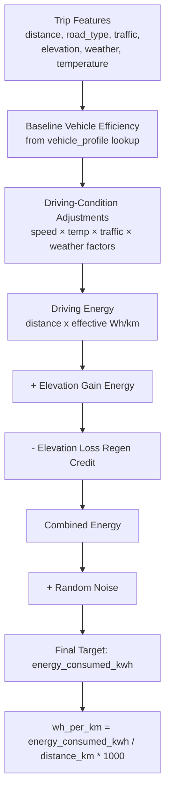

#RouteVolt #target-generation

Back to [[00 - RouteVolt Master Map]] · Previous: [[03 - EV Physics]]

> [!warning] Status
> This describes the **proposed** pipeline for computing `energy_consumed_kwh`, combining the formula pieces from [[03 - EV Physics]]. No generator script exists yet — treat this as the blueprint to implement, not a report on running code.

## Stage flowchart

## Stage-by-stage explanation

### Stage 1 — Trip features
The raw sampled/derived inputs described in [[01 - Feature Map]]. Nothing computed yet.

### Stage 2 — Baseline vehicle efficiency
Look up `vehicle_efficiency_baseline_wh_per_km` from `vehicle_profile` (140/160/190). **Why it exists:** gives every trip a starting point before conditions are applied. **Additive/multiplicative:** this *is* the multiplicative base everything else scales.

### Stage 3 — Driving-condition adjustments
Multiply baseline by `speed_factor × temp_factor × traffic_factor × weather_factor` (each defined in [[03 - EV Physics]]). **Why multiplicative:** each factor represents a % change to the ongoing rate of energy use, and percentage effects compound multiplicatively — see the dedicated section in [[03 - EV Physics]].

### Stage 4 — Driving energy
`distance_km × effective_wh_per_km / 1000`. **Units:** km × (Wh/km) / 1000 = kWh. **Why it exists:** converts the adjusted rate into an actual energy quantity for this trip's length. **Failure mode:** if `effective_wh_per_km` is allowed to go very low (e.g., extreme regen assumptions elsewhere) it could imply negative or unrealistically small driving energy — should be floored at a sane minimum (e.g., baseline × 0.5).

### Stage 5 — Elevation gain energy (additive)
`(mass_kg × 9.81 × elevation_gain_m) / 3,600,000`. **Why additive, not part of Stage 3:** it's a one-time potential-energy transaction, independent of how "efficiently" the flat-ground driving happened — see the multiplicative-vs-additive discussion in [[03 - EV Physics]]. **Assumption:** ignores drivetrain loss converting battery energy to climbing force.

### Stage 6 — Elevation loss regen credit (subtracted)
`(mass_kg × 9.81 × elevation_loss_m) / 3,600,000 × η_regen`, with η_regen < 1 (e.g., 0.65). **Why subtracted, not just "negative gain":** because it goes through a lossy conversion (motor-as-generator, battery charge acceptance) that gaining energy from the grid doesn't. **Failure mode:** must be floored so a huge descent can't make `Combined Energy` negative for a short, mostly-downhill trip — clip at zero minimum before noise is applied.

### Stage 7 — Combined energy
`driving_energy + gain_energy − loss_credit`. This is the "physically-modeled" energy use before any randomness.

### Stage 8 — Random noise
Multiply by `(1 + N(0, σ))`, σ small (e.g., 0.04), then clip at ≥0. **Why it exists:** without it, `energy_consumed_kwh` is a pure deterministic function of the other columns, which is dangerous for ML training — see [[08 - Leakage]]. **Failure mode:** σ too large produces physically implausible trips (e.g., negative-looking efficiency); σ too small leaves the leakage risk essentially unaddressed.

### Stage 9 — Final target and derived column
`energy_consumed_kwh` is the primary target. `wh_per_km = energy_consumed_kwh / distance_km × 1000` is a secondary, distance-normalized view — useful in [[07 - ML Pipeline]] for evaluating whether the model learned *efficiency* rather than just memorizing "more distance = more energy."

## Assumptions and failure modes, summarized

| Stage | Key assumption | What breaks if wrong |
|---|---|---|
| 3 | Factors are independent and multiply cleanly | Double-counting if traffic affects both `avg_speed_kmh` *and* has its own factor — must ensure the sampler and the formula don't both apply the same penalty twice (see [[02 - Feature Relationships]]) |
| 5/6 | Vehicle `mass_kg` is available | Schema doesn't currently list `mass_kg` as a column — it needs to be added (derived from `vehicle_profile`) or the elevation terms can't be computed at all. **This is a gap to fix before building the generator.** |
| 6 | Fixed η_regen | Real regen efficiency depends on descent speed/steepness; ignoring this is fine for a first version but should be documented as a known simplification |
| 8 | Noise magnitude σ | Too small → leakage risk persists; too large → target becomes unrealistic/uninformative |

Next: [[05 - Synthetic Dataset]]
