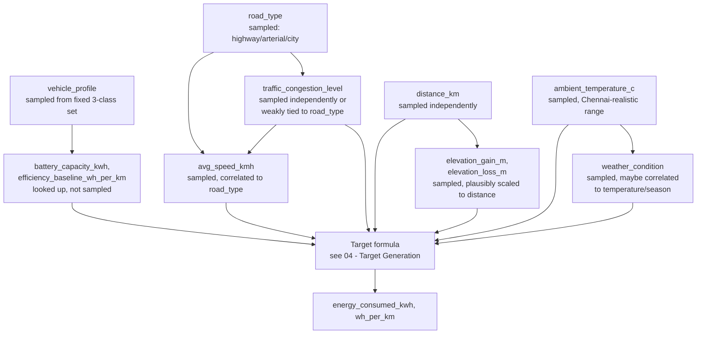

#RouteVolt #synthetic-dataset

Back to [[00 - RouteVolt Master Map]] · Previous: [[04 - Target Generation]]

> [!warning] Status
> No generator script exists. This describes the **proposed dependency order** for sampling one synthetic trip row, derived from how `dataset_schema.md` describes each column ("Source" and "Notes" columns), not from running code.

## Proposed sampling dependency order

## Why NOT sample every feature fully independently

If every column were drawn from its own distribution with zero correlation to any other column, the dataset would fail to resemble real trips in several important ways:

1. **Implausible combinations.** Fully independent sampling can produce a "highway" trip with a 15 km/h average speed, or a "city" trip averaging 110 km/h — combinations that essentially never occur in reality.
2. **No structure for the model to find.** Part of what makes a synthetic dataset *useful for testing an ML pipeline* is having realistic feature correlations for the model to (correctly) exploit or (incorrectly) overfit to — a fully independent dataset is a poor stand-in for real-world data and would validate the pipeline against an unrealistic distribution.
3. **Under/over-representation of extremes.** Independent sampling of `distance_km` and `elevation_gain_m` could generate a 2 km trip with 2,000 m of elevation gain — geometrically absurd for anywhere in or around Chennai.

## Deliberately introduced correlations (proposed)

| Correlation | Why introduce it | Risk if overdone |
|---|---|---|
| `road_type` → `avg_speed_kmh` distribution (e.g., highway ~70-100 km/h, arterial ~35-55, city ~15-30) | Matches real driving patterns | If made too strong/deterministic, `road_type` becomes a near-perfect stand-in for `avg_speed_kmh`, and the model may learn to "predict" speed from road type rather than anything about energy physics — a subtle **synthetic-data correlation** that could be mistaken for a discovered "insight" |
| `traffic_congestion_level` → downward pressure on `avg_speed_kmh` within a road_type | Matches the schema's stated intent to separate "traffic slowdown" from "eco driving slowdown" | Same risk as above, plus double-application in the energy formula if not designed carefully (see [[02 - Feature Relationships]]) |
| `distance_km` ↔ plausible bounds on `elevation_gain_m`/`elevation_loss_m` (e.g., cap gain at some multiple of distance) | Avoids geometrically impossible trips | If capped too tightly, removes natural variance the model should learn to handle |
| `ambient_temperature_c` → `weather_condition` (e.g., heavy_rain slightly more likely at certain temperature bands, if seasonally modeled) | Optional realism improvement | Low priority; the schema doesn't require it, and adding it increases generator complexity for a "minor" physical effect (see [[03 - EV Physics]] §10) |

## Real-world causal correlations vs generator design choices

This is the same distinction as [[02 - Feature Relationships]], applied specifically to the *sampling* step (as opposed to the *formula* step):

- **Real-world causal:** congestion really does slow traffic in Chennai (or anywhere) — this justifies *why* you'd want the correlation in the sampler.
- **Generator design choice:** the exact *strength* of that correlation (how much traffic congestion of 0.6 lowers expected speed, and by how much variance) is a knob you choose, not a measured real-world constant, unless you calibrate it against real traffic data.

Keep a record (in code comments or this note) of which correlations are "realism motivated" vs "arbitrary but reasonable," so future-you can revisit the arbitrary ones if the model behaves oddly.

Next: [[06 - Data Validation]]
