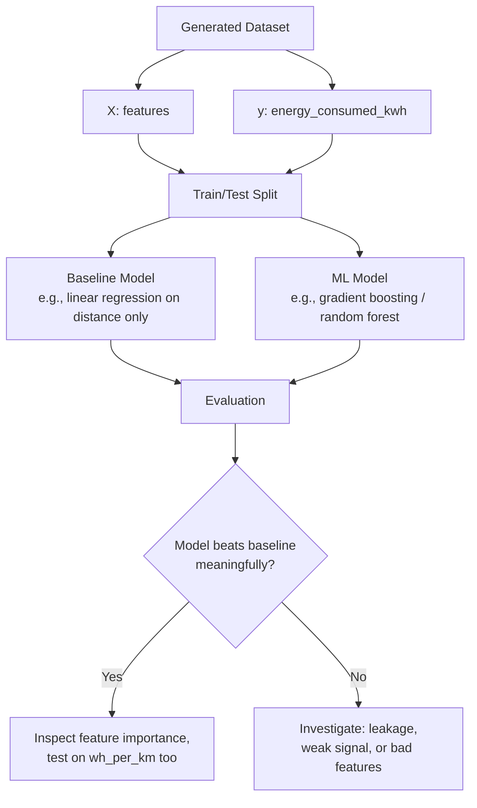

#RouteVolt #ml-pipeline

Back to [[00 - RouteVolt Master Map]] · Previous: [[06 - Data Validation]]

> [!warning] Status
> No training script exists (`scikit-learn` is a listed dependency in `pyproject.toml`, but nothing uses it yet). This note describes the pipeline you should build once the dataset from [[05 - Synthetic Dataset]] passes the checks in [[06 - Data Validation]].

## Pipeline flowchart

## X and y

- **X (features):** everything in [[01 - Feature Map]]'s table A except `trip_id`, `energy_consumed_kwh`, and `wh_per_km`. Includes both raw sampled columns and derived-from-profile columns (`vehicle_battery_capacity_kwh`, `vehicle_efficiency_baseline_wh_per_km`).
- **y (target):** `energy_consumed_kwh` primarily; `wh_per_km` as a secondary evaluation target (see below).
- **Why separate them strictly:** mixing target-derived information into X (e.g., accidentally including `wh_per_km` as a feature to predict `energy_consumed_kwh`) is direct leakage — see [[08 - Leakage]].

## What the model is actually learning

Because `energy_consumed_kwh` is generated by a **known, fixed formula plus noise** (see [[04 - Target Generation]]), the model isn't discovering a hidden truth about EVs — it's learning to **approximate the formula you wrote**, up to the noise floor. This is fine and useful (it validates your pipeline works), but it means:

- A very high R² mainly tells you "the model can approximate a formula," not "the model understands EV physics."
- The *interesting* test is whether the model's learned feature importances and partial dependence plots **qualitatively match** the structure you built (multiplicative speed/temp/traffic effects, additive elevation) — see below.

## Why distance can accidentally dominate the model

`distance_km` has, by construction, the largest and most linear influence on `energy_consumed_kwh` (see [[03 - EV Physics]] §3 and §11's numerical example). A model can achieve a deceptively high R² by mostly learning `energy ≈ distance × constant`, essentially ignoring speed, temperature, traffic, and elevation — especially if those effects are subtle relative to noise.

**How to test whether the model learned real efficiency relationships, not just distance:**
1. **Evaluate on `wh_per_km` instead of `energy_consumed_kwh`.** Since `wh_per_km` has distance algebraically factored out, a model that's only learned "more distance → more energy" will perform poorly here, while a model that's learned the efficiency adjustments will do meaningfully better than a constant-prediction baseline.
2. **Compare against a distance-only baseline.** Train a trivial model using only `distance_km`. If your full-feature model barely beats it, the other features aren't being used effectively (or aren't informative enough — revisit [[06 - Data Validation]] check 7-8).
3. **Partial dependence / feature importance, read carefully** (see below) — look specifically for whether speed, temperature, and traffic show the expected non-flat relationships, not just whether they rank above zero importance.

## Baseline

A "good baseline" isn't zero-effort — it should be the simplest model that still uses domain knowledge, e.g., linear regression on `distance_km` and `vehicle_profile` alone (the two features with the strongest, most direct physical justification). The ML model should be judged by how much it improves *over this*, not over a naive mean predictor.

## Metrics

- **RMSE / MAE in kWh** — interpretable in the units that matter for route planning (how many kWh off is a "typical" prediction).
- **R²** — useful for relative comparison between models, but see the leakage caveat in [[08 - Leakage]] about a suspiciously high R².
- **MAE or RMSE on `wh_per_km`** — the distance-normalized check described above.
- Avoid relying on a single metric; report at least RMSE-in-kWh and the `wh_per_km` check together.

## Interpreting feature importance carefully

- Feature importance in tree-based models reflects **how much the model relied on a feature to reduce error on this specific synthetic dataset** — it is not a physics measurement. If your generator made `traffic_congestion_level` weakly influential relative to noise, low importance doesn't mean traffic doesn't matter in real EVs; it means *your generator's* traffic effect was small relative to the noise you added.
- Correlated features (e.g., if `road_type` and `avg_speed_kmh` are strongly tied by generator design) can **split importance** between them or let one "steal" the other's credit, depending on the model — don't conclude one is unimportant just because a correlated partner scored higher. See [[10 - Correlation vs Causation]].
- Always cross-check importance rankings against the actual formula in [[04 - Target Generation]] — if a feature that has a real term in the formula (e.g., elevation gain) shows near-zero importance, that's a signal to debug the generator or the training pipeline, not evidence that elevation doesn't matter.

Next: [[08 - Leakage]]
