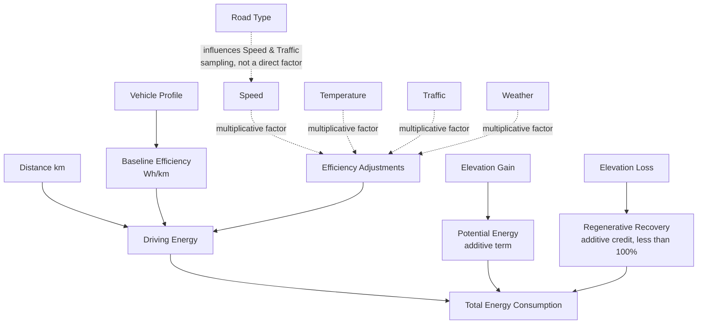

#RouteVolt #physics-flow

Back to [[00 - RouteVolt Master Map]] · Previous: [[08 - Leakage]]

> [!warning] Status
> Reflects the [PROPOSED] formula from [[03 - EV Physics]] and [[04 - Target Generation]] — not existing code.

## Reading this diagram

- **Solid arrows** = terms that are literally summed or multiplied into the energy formula in [[04 - Target Generation]].
- **Dashed arrows into "Efficiency Adjustments"** = the four condition-based multiplicative factors from [[03 - EV Physics]] (§4, §5, §6, §10), which combine into one effective Wh/km before being multiplied by distance.
- **Road Type's dashed arrow** deliberately does *not* point into the formula directly — per [[03 - EV Physics]] §7, road type is a **sampling-time proxy** for speed/traffic, not its own term in the energy equation. If a future implementation *also* gives road_type a direct multiplicative factor, that would double-count an effect already captured through speed — flag it as a design bug if you see it in real code.
- **Elevation Gain/Loss** feed into `Total Energy Consumption` as separate additive terms, never through the multiplicative "Efficiency Adjustments" box — this is the crux of the multiplicative-vs-additive discussion in [[03 - EV Physics]].

Next: [[10 - Correlation vs Causation]]
